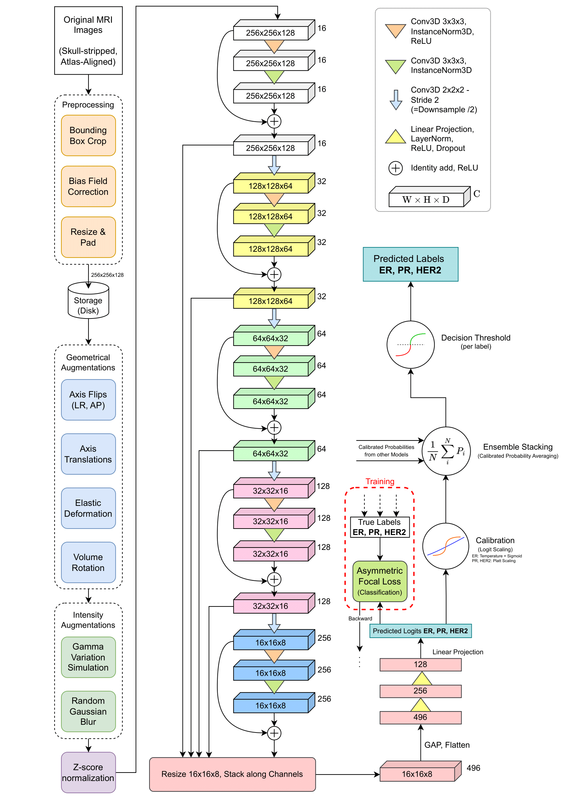

# BCBM-RadioGenomics-Classifier

Implementation of the pipeline shown in this diagram. This project is part of a research paper that will be linked upon publication.



IMPORTANT: Before running the code, activate the virtual environment by running:

```source BCBM_classifier_env/bin/activate```


Enable tensorboard with: `tensorboard --logdir models/`
then open `http://localhost:6006` in a local browser

